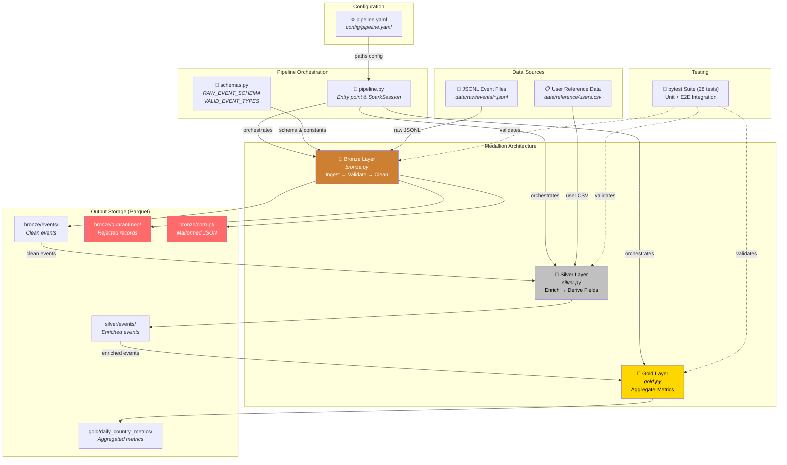
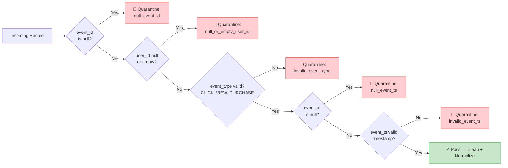

# Data Pipeline - PySpark (Medallion Architecture)

A batch data pipeline that ingests raw user event data, cleans/validates it, enriches with reference data, and produces analytics-ready aggregates using the **Bronze / Silver / Gold** medallion architecture.

---

## Project Structure

```
distribute/
├── config/
│   └── pipeline.yaml          # Pipeline configuration (paths)
├── data/
│   ├── raw/events/            # Raw JSONL event files
│   │   ├── day_2025-01-01.jsonl
│   │   └── day_2025-01-02.jsonl
│   └── reference/
│       └── users.csv          # User reference data
├── job/
│   ├── __init__.py
│   ├── pipeline.py            # Main entry point & orchestration
│   ├── schemas.py             # Explicit schemas & constants
│   ├── bronze.py              # Ingestion, validation, cleaning
│   ├── silver.py              # Enrichment with user data
│   └── gold.py                # Daily country-level aggregations
├── testing/
│   ├── __init__.py
│   ├── conftest.py            # Shared SparkSession fixture
│   ├── test_bronze.py         # Bronze layer unit tests
│   ├── test_silver.py         # Silver layer unit tests
│   ├── test_gold.py           # Gold layer unit tests
│   └── test_pipeline_e2e.py   # End-to-end integration tests
├── output/                    # Pipeline output (generated, gitignored)
│   ├── bronze/
│   │   ├── events/            # Clean events (partitioned by event_date)
│   │   ├── quarantined/       # Rejected records with reasons
│   │   └── corrupt/           # Corrupt JSON records (if any)
│   ├── silver/
│   │   └── events/            # Enriched events (partitioned by event_date)
│   └── gold/
│       └── daily_country_metrics/  # Aggregated metrics (partitioned by event_date)
├── pyproject.toml
├── requirements.txt
├── INSTRUCTION.md
└── README.md
```

---

## Architecture / Data Flow Diagram

### High-Level System Architecture



### Detailed Data Flow

```mermaid
flowchart TD
    START(["🚀 python -m job.pipeline --config config/pipeline.yaml"])
    START --> LOAD_CFG["Load pipeline.yaml"]
    LOAD_CFG --> SPARK["Create SparkSession<br/><i>local[*] mode<br/>dynamic partition overwrite</i>"]

    SPARK --> BRONZE_START

    subgraph BRONZE_LAYER ["🥉 BRONZE LAYER — bronze.py"]
        BRONZE_START["ingest_events()"] --> READ_JSON["Read JSONL with explicit schema<br/><i>PERMISSIVE mode + _corrupt_record</i>"]
        READ_JSON --> SPLIT["split_valid_corrupt()"]

        SPLIT -->|"_corrupt_record IS NOT NULL"| CORRUPT[("💀 Corrupt Records<br/><i>Malformed JSON rows</i>")]
        SPLIT -->|"_corrupt_record IS NULL"| VALIDATE["validate_and_clean()"]

        VALIDATE --> RULES{"Apply Data Quality Rules"}
        RULES -->|"❌ Fails validation"| QUARANTINE[("⚠️ Quarantined Records")]
        RULES -->|"✅ Passes validation"| CLEAN_STEPS

        subgraph CLEAN_STEPS ["Cleaning & Normalization"]
            DEDUP["Deduplicate by event_id"]
            NORM["Normalize event_type → UPPERCASE"]
            CAST["Cast value → Double (default 0.0)"]
            PARSE_TS["Parse event_ts → Timestamp"]
            ADD_DATE["Add event_date partition column"]
            DEDUP --> NORM --> CAST --> PARSE_TS --> ADD_DATE
        end
    end

    QUARANTINE --> WRITE_Q["Write → bronze/quarantined/<br/><i>Parquet, overwrite</i>"]
    CORRUPT --> WRITE_C["Write → bronze/corrupt/<br/><i>Parquet, overwrite</i>"]
    ADD_DATE --> WRITE_B["Write → bronze/events/<br/><i>Parquet, partitioned by event_date</i>"]

    WRITE_B --> SILVER_START

    subgraph SILVER_LAYER ["🥈 SILVER LAYER — silver.py"]
        SILVER_START["Read bronze/events/"] --> LOAD_USERS["load_users()<br/><i>Read users.csv<br/>Parse signup_date<br/>Fill missing country → UNKNOWN</i>"]
        LOAD_USERS --> ENRICH["enrich_events()<br/><i>LEFT JOIN on user_id</i>"]
        ENRICH --> DERIVE

        subgraph DERIVE ["Derived Fields"]
            IS_PURCHASE["is_purchase<br/><i>event_type == PURCHASE</i>"]
            DAYS_SIGNUP["days_since_signup<br/><i>datediff(event_date, signup_date)</i>"]
            FILL_COUNTRY["Fill missing country → UNKNOWN"]
        end
    end

    DERIVE --> WRITE_S["Write → silver/events/<br/><i>Parquet, partitioned by event_date</i>"]

    WRITE_S --> GOLD_START

    subgraph GOLD_LAYER ["🥇 GOLD LAYER — gold.py"]
        GOLD_START["Read silver/events/"] --> AGG["aggregate_daily_country()<br/><i>GROUP BY event_date, country</i>"]

        AGG --> METRICS

        subgraph METRICS ["Aggregated Metrics"]
            M1["total_events — COUNT(*)"]
            M2["total_value — SUM(value)"]
            M3["total_purchases — SUM(is_purchase)"]
            M4["unique_users — COUNT DISTINCT(user_id)"]
        end
    end

    METRICS --> WRITE_G["Write → gold/daily_country_metrics/<br/><i>Parquet, partitioned by event_date</i>"]
    WRITE_G --> DONE(["✅ Pipeline Complete — spark.stop()"])

    style BRONZE_LAYER fill:#FFF3E0,stroke:#CD7F32,stroke-width:2px
    style SILVER_LAYER fill:#F5F5F5,stroke:#C0C0C0,stroke-width:2px
    style GOLD_LAYER fill:#FFFDE7,stroke:#FFD700,stroke-width:2px
    style QUARANTINE fill:#FFEBEE,stroke:#ff6b6b
    style CORRUPT fill:#FFEBEE,stroke:#ff6b6b
    style WRITE_Q fill:#FFCDD2
    style WRITE_C fill:#FFCDD2
    style CLEAN_STEPS fill:#E8F5E9,stroke:#4CAF50
    style DERIVE fill:#E3F2FD,stroke:#2196F3
    style METRICS fill:#FFF9C4,stroke:#FFC107
```



### Data Quality Gate (Bronze Validation Rules)



---

## Prerequisites

- **Python 3.10+** (tested with 3.10, 3.12, 3.13)
- **Java 11+** (JDK required by PySpark)
- **Windows only:** Hadoop native binaries (`winutils.exe` + `hadoop.dll`) — see [Windows Setup](#windows-setup)

---

## Running with Docker

### Build the image

```bash
docker build -t pyspark-pipeline .
```

### Run the pipeline

```bash
docker run --rm -v $(pwd)/output:/app/output pyspark-pipeline
```

This mounts the `output/` directory so pipeline results are available on your host machine.

### Run tests

```bash
docker run --rm pyspark-pipeline python -m pytest testing/ -v
```

### Run a specific test file

```bash
docker run --rm pyspark-pipeline python -m pytest testing/test_bronze.py -v
```

---

## Setup (without Docker)

### 1. Create virtual environment and install dependencies

```bash
python -m venv .venv
```

Activate the venv:

```bash
# Windows (Git Bash)
source .venv/Scripts/activate

# Windows (cmd)
.venv\Scripts\activate

# Linux/Mac
source .venv/bin/activate
```

Install dependencies:

```bash
pip install -e .
```

Or from requirements.txt:

```bash
pip install -r requirements.txt
```

### Windows Setup

PySpark on Windows requires Hadoop native binaries. Download `winutils.exe` and `hadoop.dll` matching your Hadoop version (PySpark 3.5.x uses Hadoop 3.3.4):

1. Create `C:\hadoop\bin\` directory
2. Download `winutils.exe` and `hadoop.dll` for Hadoop 3.3.x into `C:\hadoop\bin\`
3. Set environment variables before running:

```bash
export HADOOP_HOME="C:/hadoop"
export _JAVA_OPTIONS="-Djava.library.path=C:/hadoop/bin"
```

---

## Running the Pipeline

```bash
# Activate virtual environment first
source .venv/Scripts/activate    # Windows Git Bash
# .venv\Scripts\activate         # Windows cmd

# Set env vars (Windows)
export HADOOP_HOME="C:/hadoop"
export _JAVA_OPTIONS="-Djava.library.path=C:/hadoop/bin"

# Run the pipeline
python -m job.pipeline --config config/pipeline.yaml
```

Output will be written to the `output/` directory in Parquet format.

---

## Running Tests

```bash
# Activate virtual environment first
source .venv/Scripts/activate

# Set env vars (Windows)
export HADOOP_HOME="C:/hadoop"
export _JAVA_OPTIONS="-Djava.library.path=C:/hadoop/bin"

# Run all tests
python -m pytest testing/ -v

# Run specific test file
python -m pytest testing/test_bronze.py -v
python -m pytest testing/test_silver.py -v
python -m pytest testing/test_gold.py -v
python -m pytest testing/test_pipeline_e2e.py -v
```

**Test suite (28 tests):**
- `test_bronze.py` — 13 tests: schema ingestion, validation rules, deduplication, normalization, type casting
- `test_silver.py` — 8 tests: user loading, date parsing, enrichment, derived fields, missing user handling
- `test_gold.py` — 4 tests: aggregation columns, metric values, multi-date output
- `test_pipeline_e2e.py` — 3 tests: full pipeline flow, idempotency, cross-file deduplication

---

## Pipeline Design

### Bronze Layer (`job/bronze.py`)

**Ingestion:**
- Reads all JSONL files from `data/raw/events/` using an explicit schema (all fields as strings for maximum flexibility)
- Uses Spark's PERMISSIVE mode to capture corrupt JSON rows via `_corrupt_record`

**Data Quality Rules:**

| Rule | Action |
|------|--------|
| `event_id` is null | Quarantine |
| `user_id` is null or empty | Quarantine |
| `event_type` is null or not in {CLICK, VIEW, PURCHASE} | Quarantine |
| `event_ts` is null | Quarantine |
| `event_ts` is not a valid timestamp | Quarantine |
| Duplicate `event_id` | Deduplicate (keep first) |
| `event_type` has mixed case (e.g., "click") | Normalize to uppercase |
| `value` is null or non-numeric | Fill with 0.0 / cast to double |

**Output:**
- `bronze/events/` — clean events partitioned by `event_date`
- `bronze/quarantined/` — rejected records with `rejection_reason` column
- `bronze/corrupt/` — malformed JSON rows (if any)

### Silver Layer (`job/silver.py`)

**Enrichment:**
- Left joins clean events with user reference data (`users.csv`)
- Handles missing user records gracefully (fills country with "UNKNOWN")
- Parses `signup_date`, treats invalid dates as null

**Derived fields:**
- `event_date` — date extracted from `event_ts` (carried from bronze)
- `is_purchase` — boolean, true when `event_type == "PURCHASE"`
- `days_since_signup` — integer days between `event_date` and `signup_date` (null if signup_date unknown)

**Output:**
- `silver/events/` — enriched events partitioned by `event_date`

### Gold Layer (`job/gold.py`)

**Aggregation:** Daily, country-level metrics:

| Column | Description |
|--------|-------------|
| `event_date` | Date of events |
| `country` | User's country |
| `total_events` | Count of all events |
| `total_value` | Sum of event values |
| `total_purchases` | Count of purchase events |
| `unique_users` | Count of distinct users |

**Output:**
- `gold/daily_country_metrics/` — aggregates partitioned by `event_date`

---

## Incremental & Late Data Strategy

**Approach: Partition Overwrite**

- All layers use `mode("overwrite")` with `partitionBy("event_date")`
- Spark config `spark.sql.sources.partitionOverwriteMode=dynamic` ensures only affected partitions are overwritten
- This makes the pipeline **idempotent**: reprocessing the same data produces identical results without duplication

**Late-arriving events:**
- Late events (e.g., an event with `event_ts=2024-12-31` arriving in the `day_2025-01-02.jsonl` file) are processed normally
- They are assigned to their correct `event_date` partition based on `event_ts`, not the file they arrive in
- On re-run, the affected date partition is fully rewritten with the latest data

**Trade-offs:**
- Partition overwrite is simpler than merge/upsert and sufficient for this batch pipeline
- For very large datasets, a merge strategy (e.g., Delta Lake MERGE INTO) would be more efficient as it avoids rewriting unchanged records within a partition

---

## Assumptions

1. All raw event files in `data/raw/events/` are processed together (full scan per run)
2. `event_id` is globally unique — duplicates across files are the same event and should be deduplicated
3. Event types are limited to CLICK, VIEW, and PURCHASE (case-insensitive)
4. Missing `value` defaults to 0.0 (reasonable for VIEW events)
5. Users without a matching reference record get country="UNKNOWN" and null `days_since_signup`
6. The pipeline runs from the project root directory
